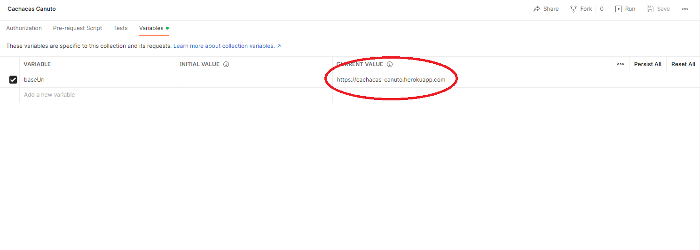

# Cachaças Canuto

## Sobre

Aplicativo desenvolvido como resolução de um desafio para processo seletivo. 

Segue o enunciado:

> O dono da Cachaças Canuto, o Sr. Victor Canuto, durante anos registrou em arquivos .JSON
(convenientemente) todos os seus produtos, clientes e vendas. O Sr. Canuto registrou tudo à mão sem
usar nenhum sistema ou ferramenta, então pode ser que contenha alguns erros de digitação ou
problemas de formatação e padronização. O Sr. Canuto precisa de um backend, em forma de uma API
REST, para gerenciar os dados e fornecer informações para o seu negócio, e ele precisa da sua ajuda.

## Funcionalidades

    
Clientes

  - [X] Busca textual por nome

  - [X] Filtro por data de nascimanento

  - [X] Dados do cliente por ID

    
Produtos

    
  - [X] Busca textual por nome

  - [X] Filtro por teor alcóolico

  - [X] Dados do produto por ID

    
Vendas

    
  - [X] Total de vendas por cliente

  - [X] Produtos mais comprados por cliente

  - [X] Filtro por data de venda

## Como rodar o aplicativo

### Instalando a coleção do Postman

A coleção do Postman está disponível [clicando aqui](https://www.getpostman.com/collections/a6e5ce2a019f8e0b62bd).

Para importar, basta fazer o download do arquivo e clicar em Import. Após anexada, a coleção irá aparecer normalmente à esquerda.

Como a url das requisições é uma variável da coleção, dependendo será necessário atualizá-la. Para isso, clique na coleção, acesse a aba de variáveis e substitua o Current Value.

 Por padrão, o valor é https://cachacas-canuto.herokuapp.com e basta realizar as requisições para testar.

### Inicializando localmente

Primeiro, é necessário clonar o repositório:

    git clone https://github.com/souzapablo/cachacas-canuto-api.git

Quando o processo terminar, basta acessar a pasta contendo o projeto CachacasCanuto.API digitando o seguinte comando:

    cd cachacas-canuto-api/src/CachacasCanuto.API

Por fim, para rodar a API, digite:

    dotnet run

A API estará rodando no endereço https://localhost:7243

### Inicializando localmente pelo Docker

Para baixar a imagem, basta utilizar o seguinte comando*:

    docker pull szpbl/cachacas-canuto

Para montar a imagem na porta 8080, digite o comando:

    docker run -p 8080:80 szpbl/cachacas-canuto

\* Caso esteja usando Linux, poderá ser necessário acrescentar sudo antes dos comandos para adicionar a permissão.

Assim, basta subistituir a url do Postman para http://localhost:8080/, uma vez que a API estará funcionando localmente.

## Tecnologias e ferramentas utilizadas

- .NET 6.0
- VS Code
- Docker
- Heroku 
- Postman

## Autor

Feito por Pablo Souza.

Entre em contato:

 

